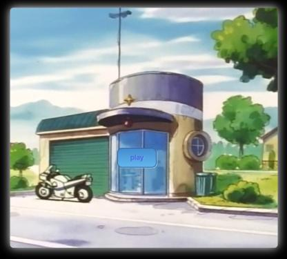
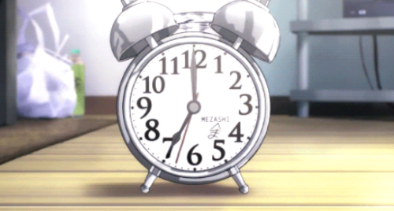
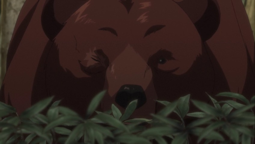

# This Is The Story Of "Policeman"

The Policeman is a game that talks about the course of a policeman's day off and revolves around how the day is completed. Players have the opportunity to experience the social and professional life of Police Men. The game is designed to be played in a 60-minute session. John is a serious policeman at work, and on his day off he have an appointment with his friends to enjoy, and when he wake up, the options for the player begin and to go through experiments with John to complete the game path related to the time of waking up. The time has great importance.

## Main game advantages:
•	You have to wake up early to have a fun day full of surprises and events.

•	John faces many problems on his journey. 

•	Your choices and values will determine John's place in military life, your social relationships, and how you interact with your surroundings. 
 
 
## Mergency: 
In the emergency, John must intervene immediately, otherwise he might be attacked and lost. Some situations include things like an attack by a Predatory animal, or an armed attack by a thief.

 
 
